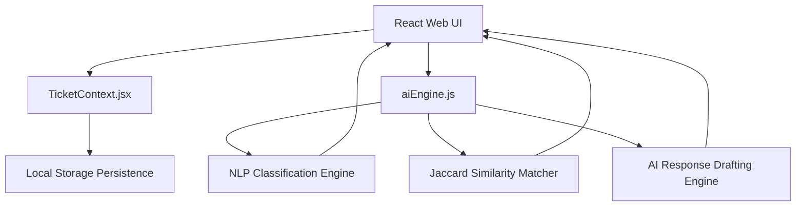

# Technical Overview & Design Note
**Role Applied For**: Intern, AI Product Engineer — The/Nudge Institute  
**Project**: NudgeSupport (AI Ticketing Co-Pilot & Self-Service Deflection Engine)  
**Submission By**: Candidate  

---

## 1. Overview of the Build
**NudgeSupport** is an intelligent, high-fidelity ticketing and co-pilot workspace designed to streamline internal support queries (IT, HR, Finance, and Admin) for The/Nudge Institute. The application consists of three main views:

*   **Employee Portal**: A modern, mobile-friendly interface for logging issues. As the employee types their issue description, a local natural language processing (NLP) model classifies the ticket's category (routing department) and displays a real-time confidence breakdown. Concurrently, a similarity engine searches a historical knowledge base of resolved tickets, presenting instant self-service resolutions to resolve the issue before a ticket is submitted ("deflection").
*   **Agent Dashboard**: An operational queue workspace where support agents manage tickets routed to their department. It features status/transition controls, message threads, and a side-by-side **AI Copilot Drafting Console** that generates customized, contextual drafts which the agent can review, modify, and apply with a single click.
*   **Analytics & AI Insights**: An administrator panel displaying live co-pilot performance metrics (ticket deflection rate, auto-routing classification accuracy, AI draft adoption rate) alongside custom SVG charts showing incoming volume trends by department and urgency.

---

## 2. Core Architecture Walkthrough
The application is structured as a single-page web app built on **React** and **Vite** for fast, modular rendering. The core layout utilizes a custom CSS grid system.

### State Management & Lifecycle
All system states (active tickets, system notifications, active tabs, and co-pilot performance metrics) are unified inside `TicketContext.jsx`. The context acts as the centralized reactive store:
1.  **Mock Database Persistence**: Syncs the mock database to the browser's `localStorage` on every mutation (creating tickets, adding comments, updating statuses) to survive hot reloads and page refreshes.
2.  **Telemetry & Metrics**: Tracks agent behavior (applying drafts, manually overriding categories, and self-deflecting tickets) to calculate real-time analytics.

### Local NLP & Suggestion Pipeline (`aiEngine.js`)
To provide instant live routing, the backend logic executes entirely client-side:
*   **Preprocessing**: Incoming text (title + description) is tokenized, stripped of punctuation, converted to lowercase, and filtered against a customized set of English and domain-specific stop words.
*   **Auto-Routing Classifier**: The tokenized terms are matched against predefined keyword vectors mapped to IT, HR, Finance, and Admin categories. The classifier calculates category scores based on match density and yields a primary recommendation. If the primary category confidence falls below 40%, the system flags it as "Low Confidence" to suggest agent review.
*   **Jaccard Similarity Duplicate Matcher**: The engine computes set-based Jaccard similarity metrics between the new issue and historical entries. Title keywords are given double weight to prioritize high-level topic alignment. If a similarity score exceeds `0.25`, the case's resolution is surfaced as a self-service candidate.
*   **Template-Based Draft Engine**: The draft response co-pilot executes rule-based templating mapped to specific intents (e.g., VPN issues, Form 16 retrieval, card reactivation, etc.) to generate personalized email drafts utilizing requester names and context.

---

## 3. Tools & Large Language Models (LLM) Used
*   **Vite + React (ES6+)**: Selected as the build tool and view library to deliver modular, component-based rendering with hot module replacement (HMR) for testing.
*   **Lucide-React**: Used for visual design icons.
*   **Local Client-Side NLP Engine**: To optimize the prototype for local testing, the AI intelligence operates entirely client-side using deterministic tokenization, weighted keyword vectors, and set-similarity mathematics.
    *   *Why solely client-side?* This decision guarantees **zero latency** (live feedback-on-keystroke), **100% operational reliability** (no external API calls, token limits, or network failures during evaluation), and **strict privacy** (highly confidential employee HR/Finance inquiries never leave the local device).
*   **Vanilla CSS (Custom Variables + Glassmorphism)**: Used to build a custom colored premium dark theme (Emerald Green / Slate) with layout templates.

---

## 4. Key Technical & Design Decisions

### A. Emerald Green & Slate Premium Aesthetic
Rather than relying on generic CSS frameworks (like Tailwind or Bootstrap) which yield standard-looking UIs, the layout is styled with hand-coded vanilla CSS utilizing custom design variables. The palette is built around an emerald green primary color (#10b981) set against deep slate shades (#090d16), using glassmorphism borders (`rgba(16, 185, 129, 0.1)`) and glow micro-animations to convey a premium, state-of-the-art co-pilot experience.

### B. Deflection-First Interaction Design
To address the primary operational metric of reducing support team load, the Employee Portal places self-service recommendations above the ticket submit action. The deflection widget expands to display issue resolutions immediately. Selecting "Yes, this resolved my issue!" triggers telemetry tracking and clears the form, preventing ticket creation entirely.

### C. Human-in-the-Loop AI Draft Workflows
Automated AI replies often suffer from hallucination or incorrect advice. To mitigate this risk, the Agent Dashboard features a side-by-side preview panel. The agent remains in complete control—reviewing, editing, or applying the AI draft directly to the text editor. Telemetry tracks when agents adopt the AI suggestions to continuously monitor system utility.

### D. Zero-Dependency Robustness
By compiling the core NLP classification, similarity scoring, and response generation into vanilla JS algorithms, the application has no external runtime dependencies. This guarantees that the codebase builds cleanly out-of-the-box (evident in the successful production build compilation) and can be easily migrated to any hosting provider.
